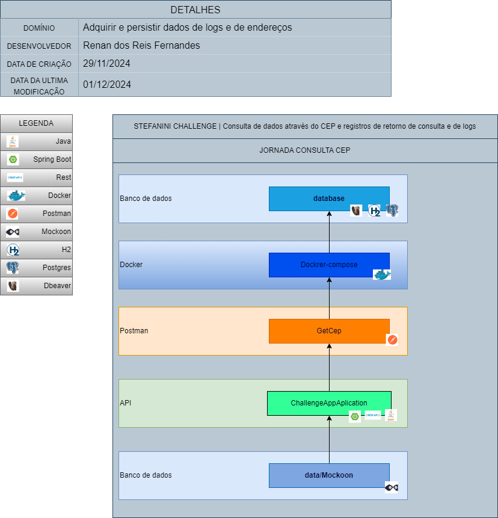

<h1 align="center">
 DESAFIO STEFANINI
 <h3 align ="center" >API de busca de endereços por CEP e persistência de dados de endereços e LOGS☕</h3> 
</h1>

### 📕 SOBRE 
**STEFANINI CHALLENGE**: A API busca endereços a partir do CEP e disponibiliza logs dos retornos das pesquisas, trazendo os dados e persistindo os dados e informações de Logs como: Horário da pesquisa, Status, endereço e mensagens de respostas de logs.

###  💡 DESENHO DE SOLUÇÕES

<p>
 
 </p><br>
 <p>
 

### 🔨 FERRAMENTAS UTILIZADAS

- [**JAVA**](https://docs.oracle.com/en/java/)
- [**SPRING BOOT**](https://docs.spring.io/spring-boot/index.html)
- [**DOCKER**](https://docs.spring.io/spring-boot/index.html)
- [**GIT**](https://git-scm.com/doc)
- [**POSTGRESQL**](https://docs.spring.io/spring-boot/index.html)
- [**DBEAVER**](https://docs.spring.io/spring-boot/index.html)
- [**MOCKOON**](https://docs.spring.io/spring-boot/index.html)
- [**GITHUB**](https://docs.github.com/pt)
- [**H2**](https://www.h2database.com/html/main.html)
- [**POSTMAN**](https://learning.postman.com/docs/introduction/overview/)

### 🦾 INSTALANDO O PROJETO NA SUA MÁQUINA
```
# CLONE O PROJETO
$ git clone https://github.com/RenanReisFernandes/stefanini-challenge.git
```

```
# INSTALE AS DEPENDÊNCIAS COM SUA IDE OU VIA TERMINAL

```

```
# VERIFIQUE SE A VERSÃO DO JAVA EM SUA MÁQUINA É A 11, DIGITE O SEGUINTE COMANDO NO TERMINAL
$ java -version
```
```
# # MOCKOON
```

```
# EXECUE O ARQUIVO DO MOCKOON QUE VEIO NOS ARQUIVOS DO PROJETO
"data.json"
```

```
## DOCKER + DBEAVER
```

```
# BAIXE O APLICATIVO DOCKER EM SUA MÁQUINA
```

```
# ABRA O APLICATIVO
```
```
# BAIXE O APLICATIVO DBEAVER em seguida escolha o banco de dados "PostgreSQL"
```
```
# NA PARTE DE CONFIGURAÇÕES DO DBEAVER DIGITE OS DADOS DO SEU BANCO DE DADOS.
OBS: Os dados de conexão como: nome do banco de dados, login, senha e configurações de conexão estãp no arquivo: "application.properties" 
```

```
# ABRA UM TERMINAL E DIGITE
"docker-compose up"
```
```
# EXECUE SUA APLICAÇÃO SPRING NA IDE DE SUA PREFERÊNCIA
```
```
# USE O POSTMAN PARA FAZER UMA REQUISIÇÃO GET COM O ENDEREÇO DO BACKEND "data.json" UTILIZANDO O MOCKOON 
```

```
# ABRA SEU BANCO DE DADOS NO APLICATIVO DBEAVER PARA VERIFICAR A PERSISTÊNCIA DE DADOS
```
```
# ATENÇÃO !!!!!!
Se houver alguma inconsistência na aplicação, clone a aplicação da branch "teste", esta versão usa o banco de dados H2 para persistência de dados e busca os dados da API ViaCep online.
```
